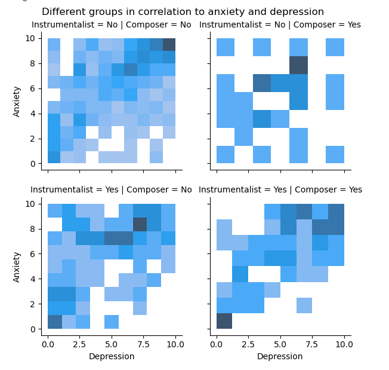

# Group 12 - Music Therapy And Mental Health

- Your title can change over time.

## Milestones

Details for Milestone are available on Canvas (left sidebar, Course Project).

## Describe your topic/interest in about 150-200 words

Given the increasing advocacy towards mental health and mental health support, we aim to explore how music may impact mental wellbeing, considering the perspectives of diverse age groups and how influential music has been in their daily lifestyle. Utilizing our findings, we hope to produce detailed, thoroughly developed, and comprehensive data visualizations that can aid the general public in understanding the influence of music on their mental health. As a dedicated team of students who have experienced our own mental hurdles, our team intends to use this project to provide a greater understanding of mental health with respect to music. 

## Describe your dataset in about 150-200 words

{Add your stuff here}

## Team Members

- Alyssa : I am a third year in microbiology. I like to play the flute, longboard and play Valorant!
- Person 2: one sentence about you!
- Person 3: one sentence about you!

## Images

{You should use this area to add a screenshot of an interesting plot, or of your dashboard}

## References

{Add your stuff here}

