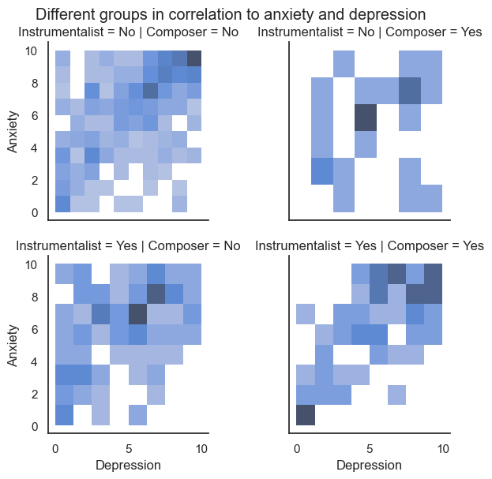
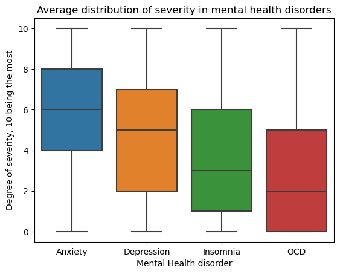
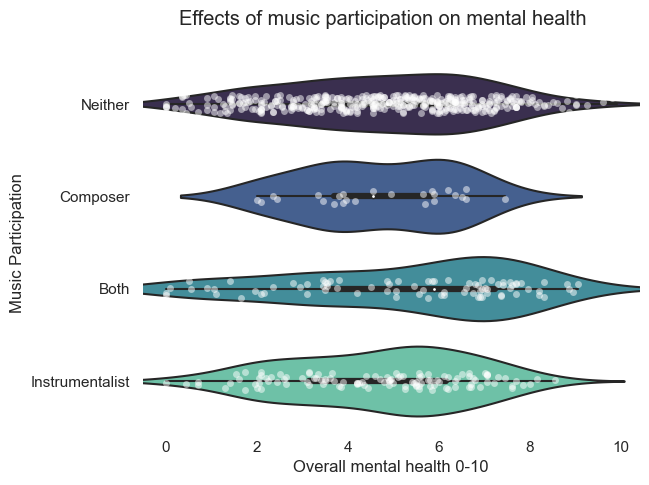
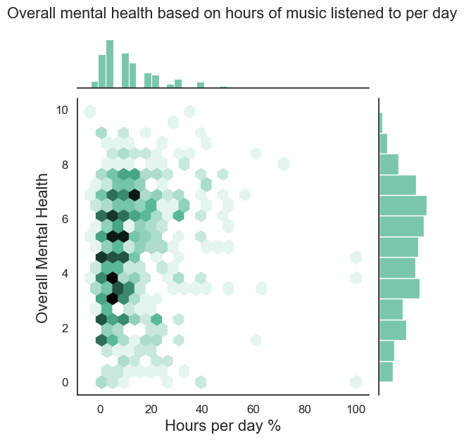
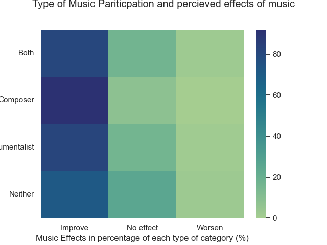
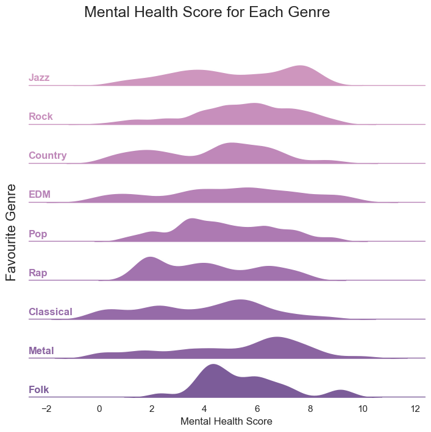
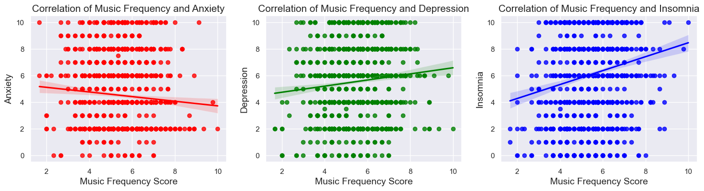
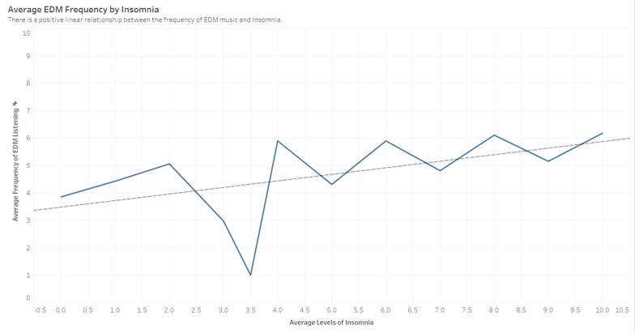

Here's the "rubric":

- Here are the **suggested sections** of your Final Report:
    - **Introduction**: A short paragraph introducing your project to the audience and a motivation for why this project is important. It's fine to say your group has an interest in this topic and were keen to explore it more.
    - **Exploratory Data Analysis**: A summary of the **highlights** of your EDA, where you can show some visualizations of the exploratory data analysis your group did.
    - **Question 1 + Results**: Clearly state your research question, and include 2-3 visualizations that helped you answer your research question. You can create multi-panel figures, but each of your visualizations must speak directly to your research question, and any insights you were able to get from it should be clearly articulated in the figure caption/description.
    - **Question 2 + Results**: Same as above.
    - **Question 3 + Results**: Same as above.
    - **Summary/Conclusion**: A brief paragraph that highlights your key results and what you learned from doing this project.

## Introduction

Given the increasing advocacy towards mental health and mental health support, we primarily aimed to explore how music may impact mental wellbeing, considering the influence of diverse music genres, amount of music listening, and extent of involvement with music. Eventually, we decided to explore the correlation of some additional factors to mental health as well, to further enrich our project. Utilizing our findings, we have produced detailed, comprehensive data visualizations that will aid the general public in understanding the influence of music and additional factors on their mental health.  

## Exploratory Data Analysis

 

I conducted an initial analysis on the distribution of anxiety and depression scores for those who identified as composers, instrumentalists, both or neither. The graph demonstrates that the group that did not participate in either composing or instrument playing was very concentrated towards the higher ends of the spectrum for both anxiety and depression. A similar concentration is observed for other groups, but they are not as severe. 
 

 

I was also interested in the distribution of mental health disorders across the various components of anxiety, depression, insomnia, and OCD. Based on this graph, it can be observed that anxiety was more severe on average of around 6, whereas OCD was the least severe of around 2.

## Question 1 + Results (Alyssa Kong)
**What is the relationship between the active participation of music in one's lifestyle (composing, playing an instrument, listening to music on a greater than average amount, or neither) in relation to the severity of mental health disorders among these individuals? How do these factors influence how they percieve the effect of music?**

To answer this question, I grouped individuals into four groups: composers, instrumentalists, both, or neither. I then created an "Overall Mental Health" score based on the four components of anxiety, depression, OCD and insomnia. Anxiety and depression was 35% of this score, insomnia was 20% and OCD was 10%. The higher the score reflected more degrees of anxiety, depression, insomnia, and OCD.
 

Graph 1: Effects of Music Participation on Mental Health.

As seen in Graph 1, there is no strong correlation demonstrated between different types of music participation and overall mental health scores. All four categories had a concentration of overall mental health scores at around the 4-6 range. It should be noted on this graph that the composer group had lower data points than the other groups.
 

Graph 2: Overall mental health based on hours of music listened to per day. 
 

Graph 2 also demonstrates that there is no correlation between overall mental health scores and amount of time spent listening to music. Hours of day spent listening to music was calculated based on a standardized percentage, based on the maximum value, standard deviation, and the mean of the dataset. The percentage of hours per day spent listening to music centers at around 0%-20%, which translates to about 1-4 hours per day. The overall mental health, however, is evenly distributed therefore no strong relationship is demonstrated.
 

Graph 3: Type of Music Participation and percieved effects of music.

 

 
In Graph 3, all four groups of music participation demonstrated that it is mostly percieved that music improves mental health. Almost 60-80% of each group believed that music improved mental health, whereas 20-30% believed it had no effect, and 0-20% believed it had a worsening effect. Out of all the groups, the composing group had the most amount of individuals who believed that music improved mental health, whereas the group that did not participate in either activity, had the least amount of individuals who believed music improved mental health.

Based on the graphs demonstrated above, there is no correlation between those who participate in different types of music and their reported severity in their overall mental health. This is shown in the violin chart, where the data is pretty much centered around the 4-7 range in terms of overall mental health score for each group of individuals. In addition, there is also no correlation between the amount of music listened to per day and the overall mental health of an individual. This can be seen in the hex-plot graph, where the overall mental health is pretty much evenly distributed for each hour of music listened to per day. Despite this, it can be seen that the type of music participation can affect how the music effects on mental health is percieved. Those who are composers tend to report that music improved their mental health moreso compared to those who did not participate in music composing or playing. However, it can be seen in the heat map that all three groups percieve music to have a positive effect on their mental health in general.

## Question 2 + Results (Haider Mohammad)

**Is there a correlation between the frequency of how often individuals between the ages of 15-30 listen to their favourite music genre, and if those habits have any underlying effects on mental health conditions? Are there external factors impacting greater insomnia levels for people who listen to more EDM?**

### Graph 1: Mental Health Score for Each Genre

In my dataset, I made a column titled "Mental Health Score" which found the average between an individuals anxiety, depression, and insomnia levels. Based on this, I compared those numbers to people's favourites genres to get a big picture of how music genres are connected to mental health conditions. I got these results by creating a facet grid. The results were pretty interesting since genres like Jazz, Rock and EDM showed higher levels of mental health levels compared to genres like Country, Classical and Folk. 

Obviously these numbers don't paint the full picture but it's a good starting point to see if specific genres have different effects on the mind. I also understood there are many factors affecting these results, therefore, I did more research to answer these questions.

### Graph 2: Correlation Between Frequency of Music Genres and Mental Health Conditions  

To go more in depth, I wanted to see the relationship between each genre and mental health condition, instead of an average of mental health. This would allow me to see some genuine patterns worth studying. Based on my results, I found the following correlations interesting along with my initial thoughts:
1. EDM and Insomnia (positive relationship)
    - This is by far the strongest correlation at 0.21. Electronic Dance Music (EDM) is intended for large crowds of dancers which is far from ideal for sleeping. Listening to EDM before sleeping would make it hard to sleep.
2. Jazz and Insomnia (positive relationship)
    - Jazz requires a lot of different instruments such as trumpet which can be disturbing for those trying to sleep. Similar to EDM, it does make sense why Jazz might lead to bad sleep.
3. EDM and Anxiety (negative relationship)
    - This is the first negative relationship meaning EDM reduces anxiety? It's certainly interesting but I suppose going to places like clubs and parties where EDM is most used could help people forget their troubles for a little bit

### Graph 3: Average EDM Frequency by Insomnia

Through graph 2, I started going more in depth with the EDM and Insomnia relationship. I found there was a direct connection between the two by making a line chart on Tableau. I studied alchol and smoking consumptions levels and determined those two factors were not necessarily affecting EDM and Insomnia. This was because alchol and smoking levels were increasing as age increased while insomnia levels decrease, suggesting there wasn't a strong enough connection between acohol/amoking and insomnia. 

While EDM likely isn't the only reason behind insomnia, I think it's fair to assume it plays a role based on the research. However, additional research would be required to determine the exact percentage of indluence. 

## Question 3 + Results (Zainab Mohammad)

## Summary/Conclusion

# Work in progress

## **Zainab Mohammad** 
---

During EDA, I made the overall mental health plots. explain why I kept outliers, and why I made individual plots for each mental health condition instead of keeping it as one. 

### Research Question 1:

**Do either an individual’s age or the amount of music they listen to have an effect on their mental health; which one has a stronger correlation with which mental health problem?**

(Use tableau plots bc more concise)

 
As visualized in Figure #, ___ 

 
As visualized in Figure #+1, ___ 

Now that we know this, a sub-question I want to explore is:

**Sub-question: How much of the day do most individuals usually spend listening to music- what is the “mode” value of this aspect?**

Maybe use the tableau plot. Could also use IQR range?
 

 
As visualized in Figure #+2, ___ 

This is relatively low so that’s good! I also want to explore one more sub-question: 

Of the four mental health conditions (anxiety, depression, OCD, and insomnia), which one is the most prevalent?

(Show the box plot)

 
As visualized in Figure #+3, ___ 

Based on our earlier conclusion that the quantity of music listening and mental health problems have a positive correlation. Based on these previous questions, it can be seen that overall, people rank their mental health problems quite high on the scale, especially their anxiety and depression. Thus, it suggests that even though a lot of people are listening to music for only around 8.3% (and __) of their days, they should try to further lessen this number as this may help bring down their mental health problems. 

Ok now. The first set of research questions yielded very interesting results. Since depression and anxiety are the two most prevalent mental health conditions based on the box plot, and we learned that younger populations tend to suffer more, i thought i’d explore to see what other factors may be contributors. Young populations often include students, so I found a dataset on student mental health. This dataset correlates anxiety and depression presence to year level and CGPA. I wanted to learn if either of these factors possibly contribute to anxiety and depression:

### Research Question #2:

**What correlation do the academic factors of "Year level" and "CGPA" (cumulative GPA) have with depression and anxiety?**

Include the 4 bar plots from analysis file to show this for the 2x2 conditions 

(explanation of plots from analysis file)

### Research Question #3:

**Does the choice of primary streaming service of music have a correlation with mental health?**

Use Tableau tables to show what the highest and lowest levels of problems are in which users (average-based)

Use plots from analysis file (heatmaps) to show the modes? Like “for anxiety the mode falls at 7 for all service-users but for depression, the mode is about 7 for all but 3 for pandora!”

In conlusion, the datasets have yielded lots of fascinating trends. ___ (summarize)
Correlation does not imply causation. Also having more participants will allow for more accurate results. 
