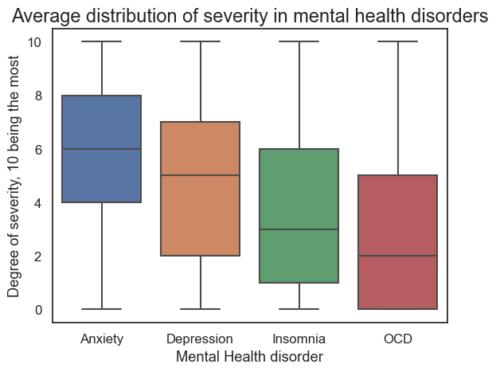
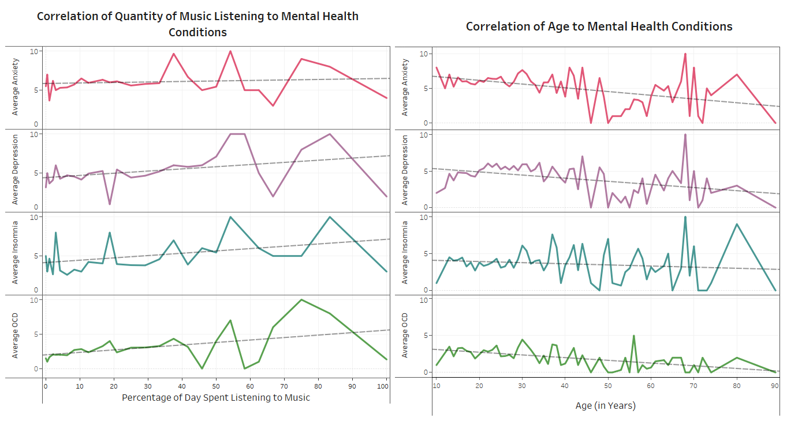
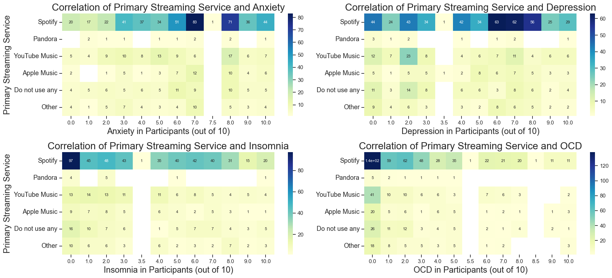

Here's the "rubric":

- Here are the **suggested sections** of your Final Report:
    - **Introduction**: A short paragraph introducing your project to the audience and a motivation for why this project is important. It's fine to say your group has an interest in this topic and were keen to explore it more.
    - **Exploratory Data Analysis**: A summary of the **highlights** of your EDA, where you can show some visualizations of the exploratory data analysis your group did.
    - **Question 1 + Results**: Clearly state your research question, and include 2-3 visualizations that helped you answer your research question. You can create multi-panel figures, but each of your visualizations must speak directly to your research question, and any insights you were able to get from it should be clearly articulated in the figure caption/description.
    - **Question 2 + Results**: Same as above.
    - **Question 3 + Results**: Same as above.
    - **Summary/Conclusion**: A brief paragraph that highlights your key results and what you learned from doing this project.

## Introduction

Given the increasing advocacy towards mental health and mental health support, we primarily aimed to explore how music may impact mental wellbeing, considering the influence of diverse music genres, amount of music listening, and extent of involvement with music. Eventually, we decided to explore the correlation of some additional factors to mental health as well, to further enrich our project. Utilizing our findings, we have produced detailed, comprehensive data visualizations that will aid the general public in understanding the influence of music and additional factors on their mental health.  

## Exploratory Data Analysis
 

 

We were interested in the distribution of the four mental health conditions, anxiety, depression, insomnia, and OCD. Based on this figure, we could learn that overall, anxiety was more severe at an average of around 6 and it had the least amount of standard deviation, whereas OCD was the least severe at an average of around 2. Depression had an average score of about 5 and insomnia had a score about 3.  

 

Since one of our interests lay within exploring how the daily amount of music varies and affects mental health, we plotted a displot to gain a better understanding of how much music individuals from the first study tend to listen to, and if there are any outliers. The mode value is at around 10% of the day, and overall, it can be seen that most participants listen to music for only ~0-40% of their day. While there are outliers- some people reported listening to music for 100% of their day, all datapoints will be kept as they may allow for better, more accurate trend observations. 
 

 

Another interest is within exploring how age affects mental health, so we plotted a simple displot to gain a better understanding of the age range of the participants of the first study. Overall, it can be seen that most participants were aged around 20, although the total range spans from around 10 to almost 90. While there are outliers, all datapoints will be kept since there was no limit to which age groups could partake in this survey. A wider range will likely allow for more thorough results.
 

 

For the second dataset on Student Mental Health, all the overlapping columns were kept (overlapping with initial dataset), and the Age column was visualized by a countplot to understand the age range of participants in this study (it was geared towards university students). The countplot above shows the mode value (highest value) is 18, and the next two highest values are 19 and 24 (both have similar counts). The other three ages were 20, 21, and 22 year olds, but their participation was lower. The range is only from 18-24, so overall, since all participants are younger individuals, I think this dataset will be appropriate to study the effects of academics on "younger individuals".  
 

## Question 1 + Results (Alyssa Kong)
**What is the relationship between the active participation of music in one's lifestyle (composing, playing an instrument, listening to music on a greater than average amount, or neither) in relation to the severity of mental health disorders among these individuals? How do these factors influence how they percieve the effect of music?**

To answer this question, I grouped individuals into four groups: composers, instrumentalists, both, or neither. I then created an "Overall Mental Health" score based on the four components of anxiety, depression, OCD and insomnia. Anxiety and depression was 35% of this score, insomnia was 20% and OCD was 10%. The higher the score reflected more degrees of anxiety, depression, insomnia, and OCD.
 

Figure 1: Effects of music participation on mental health.

As seen in Figure 1, there is no strong correlation demonstrated between different types of music participation and overall mental health scores. All four categories had a concentration of overall mental health scores at around the 4-7 range. It should be noted on this figure that the composer group had lower data points than the other groups whereas the group that participated in neither activity had the greatest amount of points. The lack of data points in the composing group may be the cause of the bimodal distribution seen in the graph.
 

Figure 2: Different groups plotted against anxiety and depression. 

 

To be able to understand different mental health components in relation to these groups, I created graphs based on each component. I specifically chose this figure as it highlighted two mental health components that were highly prevalent in society: anxiety and depression. Figure 2 demonstrates that there is a greater upper right leaning distribution of data in the group that did not participate in either composing or instrument playing. This suggests the group that did not participate in any sort of music activity had greater levels of depression and anxiety. The groups that participated in specifically composing or instrument playing had lower levels of anxiety and depression, demonstrated by the distribution of dark coloured squares. The group that participated in both instrument and composing activities demonstrated highly variable severities in anxiety and depression. There is a concentration towards extremely low anxiety and depression and a concentration at high anxiety and depression as well. An additional analysis for OCD and insomnia can be found in analysis1.ipynb a well.

Figure 3: Type of music participation and percieved effects of music.
 

 
In Figure 3, all four groups of music participation demonstrated that it is mostly percieved that music improves mental health. Almost 60-80% of each group believed that music improved mental health, whereas 20-30% believed it had no effect, and 0-20% believed it had a worsening effect. Out of all the groups, the composing group had the most amount of individuals who believed that music improved mental health, whereas the group that did not participate in either activity, had the least amount of individuals who believed music improved mental health. If this graph is correlated to a graph in my Tableau dashboard, a really interesting relationship can be seen where despite those who believed music had no effect on their mental health, they had the best mental health among all three groups of people who believed it either improved, had no effect, or worsened their mental health. 
 

## Question 2 + Results (Haider Mohammad)

**Is there a correlation between the frequency of how often individuals between the ages of 15-30 listen to their favourite music genre, and if those habits have any underlying effects on mental health conditions? Are there external factors impacting greater insomnia levels for people who listen to more EDM?**

Figure 4: Mental Health Score for Each Genre

In my dataset, I made a column titled "Mental Health Score" which found the average between an individuals anxiety, depression, and insomnia levels. Based on this, I compared those numbers to people's favourites genres to get a big picture of how music genres are connected to mental health conditions. I got these results by creating a facet grid. The results were pretty interesting since genres like Jazz, Rock and EDM showed higher levels of mental health levels compared to genres like Country, Classical and Folk. 

Obviously these numbers don't paint the full picture but it's a good starting point to see if specific genres have different effects on the mind. I also understood there are many factors affecting these results, therefore, I did more research to answer these questions.

Figure 5: Correlation Between Frequency of Music Genres and Mental Health Conditions  

To go more in depth, I wanted to see the relationship between each genre and mental health condition, instead of an average of mental health. This would allow me to see some genuine patterns worth studying. Based on my results, I found the following correlations interesting along with my initial thoughts:
1. EDM and Insomnia (positive relationship)
    - This is by far the strongest correlation at 0.21. Electronic Dance Music (EDM) is intended for large crowds of dancers which is far from ideal for sleeping. Listening to EDM before sleeping would make it hard to sleep.
2. Jazz and Insomnia (positive relationship)
    - Jazz requires a lot of different instruments such as trumpet which can be disturbing for those trying to sleep. Similar to EDM, it does make sense why Jazz might lead to bad sleep.
3. EDM and Anxiety (negative relationship)
    - This is the first negative relationship meaning EDM reduces anxiety? It's certainly interesting but I suppose going to places like clubs and parties where EDM is most used could help people forget their troubles for a little bit

Figure 6: Average EDM Frequency by Insomnia

Through figure 2, I started going more in depth with the EDM and Insomnia relationship. I found there was a direct connection between the two by making a line chart on Tableau. I studied alchol and smoking consumptions levels and determined those two factors were not necessarily affecting EDM and Insomnia. This was because alchol and smoking levels were increasing as age increased while insomnia levels decrease, suggesting there wasn't a strong enough connection between acohol/amoking and insomnia. 

While EDM likely isn't the only reason behind insomnia, I think it's fair to assume it plays a role based on the research. However, additional research would be required to determine the exact percentage of indluence. 

To see my [entire analysis](https://github.com/ubco-W2022T2-data301/project-group-group12/blob/main/analysis/analysis2Haider.ipynb), you can access my full work.

## Question 3 + Results (Zainab Mohammad)

**Do either the amount of daily music listening or age have an effect on an individual's mental health, and if so, what are the correlation patterns?**

Figure 7: Correlation of age and quantity of music listening to mental health conditions.
 

As visualized in Figure 1, there are two lineplots. The one on the left plots the average ranking of the four mental health conditions against the percentage of day spent listening to music. For all four conditions, a positive correlation is seen, such that as the percentage of music listening in a day increases, the overall average ranking of each of the mental health conditions also increases. This positive correlation can be identified due to the plotted trendlines (dashed gray lines), which increase in the upwards direction for all four of the subplots. Next, the lineplot on the right plots average ranking of the four mental health conditions against age. For all four conditions, the respective trendlines go in the downwards direction as age increases, which suggests a negative correlation between average mental health problems and age. This means that as age increases, the overall average ranking of each of the mental health conditions decrease, such that older individuals experience less mental health problems. Since younger populations experience more mental health problems, an additional dataset was explored which correlated academics (specifically a student's GPA and year of study) to mental health; analysis and visualizations for that can be found in the [analysis file](analysis/analysisZainab.ipynb). 

**Sub-question: Does the choice of primary streaming service (for listening to music) have a correlation with mental health?**

Figure 8: Correlation of primary streaming services to mental health conditions.
 

After discovering the correlation of music listening and mental health conditions, I was curious to explore another aspect of music. I decided to examine if the music streaming service that an individual chooses to use also has an effect on the four different mental health conditions or not. I chose to evaluate the mode values of the rankings since this would indicate what the most common ranking for a mental health condition was for different primary streaming service users. For this purpose, heatmaps seemed logical, as are visualized in Figure 2. Scales are provided for each heatmap, to their right.
 

The heatmap at the top left is for anxiety, and it showed the mode rating of anxiety to be around 7 (either 6, 7, or 8) for all the various streaming service users. The heatmap on the bottom left is for insomnia, and it showed the mode rating of insomnia to be around 1 (either 0, 1, or 2) for all the various streaming service users. The heatmap on the bottom right is for OCD, and it showed the mode rating of OCD to be 0 for all the various streaming service users. These three heatmaps all indicate the same results, that **the mental health conditions anxiety, insomnia, and OCD do not have a strong correlation to the choice of streaming service.** 
 

The notable heatmap is the top right one, which is for depression. The mode value of rated depression was a 6 by Spotify users, a 0 by Pandora users, a 2 by YouTube Music users, a 5 by Apple Music users, a 2 by users not using any streaming service, and 0 and 6 (bimodal) by users using other streaming services. Most of the mode values were on the lower end of the range, but both Spotify users and Apple Music users had relatively higher mode values, indicating that **Spotify and Apple Music users tend to have higher depression levels than all other music listeners**. Also, Pandora had the lowest mode value of 0, suggesting **Pandora users experience the least amount of depression.** 

Figure 9: Average depression for various primary streaming service users.

 

Figure 3 was created to prove the findings concluded from Figure 2. The barplot has the average values of the various streaming service options plotted against the rating of depression (on a scale out of 10), and indeed, it can be seen that **Spotify and Apple Music users both have relatively higher average depression scores of over 5, whereas all other averages are around 4 or less. Pandora clearly has the lowest average, indicating that Pandora users are indeed the least depressed. 

Further detail on Zainab's analysis and conclusions can be found [here](analysis/analysisZainab.ipynb). 

## Summary/Conclusion

In conlusion, our chosen datasets yielded lots of fascinating trends. 

Based on the first question, the data visualizations demonstrated the relationship between active participation in one's lifestyle in relation to the severity in mental health disorders is variable based on the different components of mental health. Graph 1 demonstrated there is no correlation between those who participated in different music activities and the severity in their overall calculated mental health. In the violin chart, the data is pretty much centered around the 4-7 range in terms of overall mental health score for each group of individuals. As such, when all factors such as anxiety, depression, insomnia, and OCD are considered; there is no relationship between music activity participation and mental health. However, Graph 2 demonstrated that when the mental health scores are separated into different components such as anxiety and depression, there are groups with higher degrees of severity compared to others. Anxiety and depression was the highest among those who were neither composers nor instrumentalists. However, the composing group had higher degrees of insomnia compared to other groups. In addition, it can be seen that the type of music participation can affect how people believe music effects mental health. Those who are composers tend to report that music improved their mental health moreso compared to those who did not participate in music composing or instrument playing. However, Graph 3 demonstrates that all three groups percieve music to have a positive effect on their mental health in general. Ultimately, these graphs do not show causation however, so it cannot be determined which variable is caused or influenced by another or if there is merely a correlation in different groups due to lifestyle factors.

There is a positive correlation between daily music listening and mental health conditions, and negative correlation between age and mental health conditions. This implies that younger individuals who listen to more music every day likely have much worse mental health than older individuals who listen to minimal music in a day; younger individuals may have worse mental health due to academic reasons, like a lower CGPA and higher year of study. Lastly, it was found that Spotify and Apple Music users are likely to have higher levels of depression and Pandora users are likely to have lower levels of depression, compared to all other streaming services users; in contrast, for anxiety, insomnia, and OCD, the severity of each mental health condition was generally similar in all users regardless of which streaming service was used. 

In closing, the idea of "correlation does not imply causation" should be revisited- just because we witnessed correlation between various variables through this project does not imply causation, so further research should be conducted before these results can be further published. It should also be noted that repeating these surveys may also be worthwhile as that will increase the sample size, allowing for more accurate results. 

  

During EDA, I made the overall mental health plots. explain why I kept outliers, and why I made individual plots for each mental health condition instead of keeping it as one. 

The first set of research questions yielded very interesting results. Since depression and anxiety are the two most prevalent mental health conditions based on the box plot, and we learned that younger populations tend to suffer more, i thought i’d explore to see what other factors may be contributors. Young populations often include students, so I found a dataset on student mental health. This dataset correlates anxiety and depression presence to year level and CGPA. I wanted to learn if either of these factors possibly contribute to anxiety and depression:

