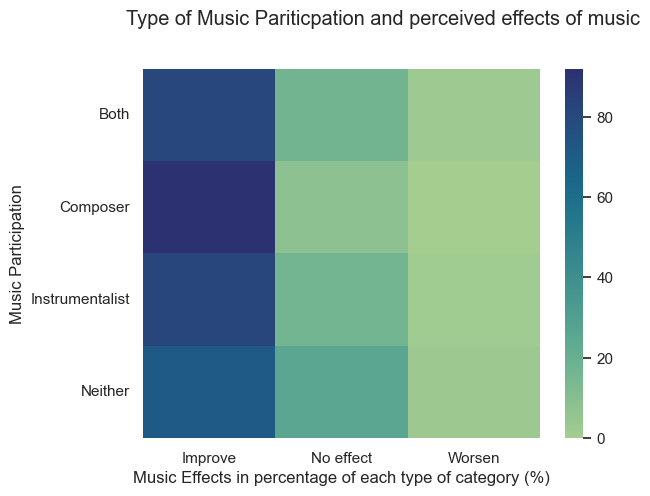
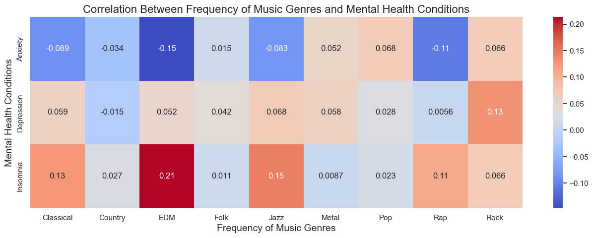

Here's the "rubric":

- Here are the **suggested sections** of your Final Report:
    - **Introduction**: A short paragraph introducing your project to the audience and a motivation for why this project is important. It's fine to say your group has an interest in this topic and were keen to explore it more.
    - **Exploratory Data Analysis**: A summary of the **highlights** of your EDA, where you can show some visualizations of the exploratory data analysis your group did.
    - **Question 1 + Results**: Clearly state your research question, and include 2-3 visualizations that helped you answer your research question. You can create multi-panel figures, but each of your visualizations must speak directly to your research question, and any insights you were able to get from it should be clearly articulated in the figure caption/description.
    - **Question 2 + Results**: Same as above.
    - **Question 3 + Results**: Same as above.
    - **Summary/Conclusion**: A brief paragraph that highlights your key results and what you learned from doing this project.

## Introduction

Given the increasing advocacy towards mental health and mental health support, we primarily aimed to explore how music may impact mental wellbeing, considering the influence of diverse music genres, amount of music listening, and extent of involvement with music. Eventually, we decided to explore the correlation of some additional factors to mental health as well, to further enrich our project. Utilizing our findings, we have produced detailed, comprehensive data visualizations that will aid the general public in understanding the influence of music and additional factors on their mental health.  

## Exploratory Data Analysis

## Question 1 + Results (Alyssa Kong)
**What is the relationship between the active participation of music in one's lifestyle (composing, playing an instrument, listening to music on a greater than average amount, or neither) in relation to the severity of mental health disorders among these individuals? How do these factors influence how they percieve the effect of music?**

Graph 1: Effects of Music Participation on Mental Health.

Graph 2: Overall mental health based on hours of music listened to per day.

Graph 3: Type of Music Participation and percieved effects of music.

Based on the graphs demonstrated above, there is no correlation between those who participate in different types of music and their reported severity in their overall mental health. This is shown in the violin chart, where the data is pretty much centered around the 4-7 range in terms of overall mental health score for each group of individuals. In addition, there is also no correlation between the amount of music listened to per day and the overall mental health of an individual. This can be seen in the hex-plot graph, where the overall mental health is pretty much evenly distributed for each hour of music listened to per day. Despite this, it can be seen that the type of music participation can affect how the music effects on mental health is percieved. Those who are composers tend to report that music improved their mental health moreso compared to those who did not participate in music composing or playing. However, it can be seen in the heat map that all three groups percieve music to have a positive effect on their mental health in general.

## Question 2 + Results (Haider Mohammad)

**Is there a correlation between the frequency of how often individuals between the ages of 15-30 listen to their favourite music genre, and if those habits have any underlying effects on mental health conditions? Are there external factors impacting greater insomnia levels for people who listen to more EDM?**

##### Graph 1: Mental Health Score for Each Genre

In my dataset, I made a column titled "Mental Health Score" which found the average between an individuals anxiety, depression, and insomnia levels. Based on this, I compared those numbers to people's favourites genres to get a big picture of how music genres are connected to mental health conditions. I got these results by creating a facet grid. The results were pretty interesting since genres like Jazz, Rock and EDM showed higher levels of mental health levels compared to genres like Country, Classical and Folk. 

Obviously these numbers don't paint the full picture but it's a good starting point to see if specific genres have different effects on the mind. I also understood there are many factors affecting these results, therefore, I did more research to answer these questions.

##### Graph 2: Correlation Between Frequency of Music Genres and Mental Health Conditions  

To go more in depth, I wanted to see the relationship between each genre and mental health condition, instead of an average of mental health. This would allow me to see some genuine patterns worth studying. Based on my results, I found the following correlations interesting along with my initial thoughts:
1. EDM and Insomnia (positive relationship)
    - This is by far the strongest correlation at 0.21. Electronic Dance Music (EDM) is intended for large crowds of dancers which is far from ideal for sleeping. Listening to EDM before sleeping would make it hard to sleep.
2. Jazz and Insomnia (positive relationship)
    - Jazz requires a lot of different instruments such as trumpet which can be disturbing for those trying to sleep. Similar to EDM, it does make sense why Jazz might lead to bad sleep.
3. EDM and Anxiety (negative relationship)
    - This is the first negative relationship meaning EDM reduces anxiety? It's certainly interesting but I suppose going to places like clubs and parties where EDM is most used could help people forget their troubles for a little bit

##### Graph 3: Average EDM Frequency by Insomnia

Through graph 2, I started going more in depth with the EDM and Insomnia relationship. I found there was a direct connection between the two by making a line chart on Tableau. I studied alchol and smoking consumptions levels and determined those two factors were not necessarily affecting EDM and Insomnia. This was because alchol and smoking levels were increasing as age increased while insomnia levels decrease, suggesting there wasn't a strong enough connection between acohol/amoking and insomnia. 

While EDM likely isn't the only reason behind insomnia, I think it's fair to assume it plays a role based on the research. However, additional research would be required to determine the exact percentage of indluence. 

## Question 3 + Results (Zainab Mohammad)

## Summary/Conclusion